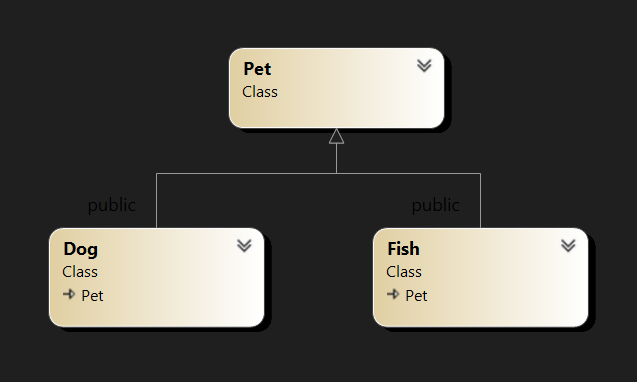

# Workshop #7: Derived Classes and Functions in a Hierarchy

Version v1.0

You have been contracted to prototype software to implement a virtual pet.   Your customer
is looking to create various types of pets, each with different levels of requirements for care and
varying fee schedules.  Once a pet has been purchased (ie: instantiated), owners are required to care for it and provide basic needs: Nutrition (feed), Affection (hug), Cleaning (groom).

All pets maintain a health level which is calculated at the end of each day. Health level is updated based on difference between required and received level of care at end of each day. Perfect Health = 1.0; > or < is over/under nourished; > 2 or < 0 will result in pet being perished (dying).

Fees to owners include initial purchase, feeding, re-spawning, and cloning. Grooming and hugs are presently free.

Your Task: Develop derived classes to maximize code re-use and validate against tester such that your code can be used as prototype, evaluating feasibility of virtual pets.  

- Base Class: **Pet**; Derived Classes: **Dog, Fish**<br>
- Note the complete class definition and implementation for the base class **Pet** is provided. 
- Use of virtual functions is **not** required.

## Learning Outcomes

Upon successful completion of this workshop, you will have demonstrated the ability to:

* Extend an existing base class:
  * Use private data attributes within the base class
  * Use protected methods for derived classes to access data attributes in the base class
* Define and implement derived classes:
  * Override a subset of methods from the base class
  * Create new methods not present in the base class
  * Invoke base class methods and constructors passing parameters
* Leverage class hierarchies to promote code re-use

## Submission Policy


The workshop is divided into one coding part and one non-coding part:

- Part 1 (**LAB**): A step-by-step guided workshop, worth 100% of the workshop's total mark
> Please note that the part 1 section is **not to be started in your first session of the week**. You should start it on your own before the day of your class and join the first session of the week to ask for help and correct your mistakes (if there are any).
- Part 2 (reflection): non-coding part. The reflection doesn't have marks associated with it but can incur a **penalty of max 40% of the whole workshop's mark** if your professor deems it insufficient (you make your marks from the code, but you can lose some on the reflection).

## Due Dates

The Due dates depend on your section. Please choose the "-due" option of the submitter program to see the exact due date of your section:

```bash
~profname.proflastname/submit 2??/wX/pY_sss -due<ENTER>
```
- Replace **??** with your subject code (`00 or 44`)
- Replace **X** with Workshop number: [`1 to 10`]
- Replace **Y** with the part number: [`1 or 2`]
- Replace **sss** with the section: [`naa, nbb, nra, zaa, etc...`]

## Late penalties
You are allowed to submit your work up to 2 days after the due date with a 30% penalty for each day. After that, the submission will be closed and the mark will be zero.

## Citation

Every file that you submit must contain (as a comment) at the top:<br />
**your name**, **your Seneca email**, **Seneca Student ID** and the **date** when you completed the work.

### For work that is done entirely by you (ONLY YOU)

If the file contains only your work or the work provided to you by your professor, add the following message as a comment at the top of the file:

> I have done all the coding by myself and only copied the code that my professor provided to complete my workshops and assignments.

### For work that is done partially by you.

If the file contains work that is not yours (you found it online or somebody provided it to you), **write exactly which part of the assignment is given to you as help, who gave it to you, or which source you received it from.**  By doing this you will only lose the mark for the parts you got help for, and the person helping you will be clear of any wrongdoing.

> - Add the citation to the file in which you have the borrowed code
> - In the 'reflect.txt` submission of part 2 (DIY), add exactly what is added to which file and from where (or whom).

> :warning: This [Submission Policy](#submission-policy) only applies to the workshops. All other assessments in this subject have their own submission policies.

### If you have helped someone with your code

If you have helped someone with your code. Let them know of these regulations and in your 'reflect.txt' of part 2 (DIY), write exactly which part of your code was copied and who was the recipient of this code.<br />By doing this you will be clear of any wrongdoing if the recipient of the code does not honour these regulations.

## Compiling and Testing Your Program

All your code should be compiled using this command on `matrix`:

```bash
g++ -Wall -std=c++11 -g -o ws file1.cpp file2.cpp ...
```

- `-Wall`: the compiler will report all warnings
- `-std=c++11`: the code will be compiled using the C++11 standard
- `-g`: the executable file will contain debugging symbols, allowing *valgrind* to create better reports
- `-o ws`: the compiled application will be named `ws`

After compiling and testing your code, run your program as follows to check for possible memory leaks (assuming your executable name is `ws`):

```bash
valgrind --show-error-list=yes --leak-check=full --show-leak-kinds=all --track-origins=yes ws
```

- `--show-error-list=yes`: show the list of detected errors
- `--leak-check=full`: check for all types of memory problems
- `--show-leak-kinds=all`: show all types of memory leaks identified (enabled by the previous flag)
- `--track-origins=yes`: tracks the origin of uninitialized values (`g++` must use `-g` flag for compilation, so the information displayed here is meaningful).

To check the output, use a program that can compare text files.  Search online for such a program for your platform, or use *diff* available on `matrix`.

> Note: All the code written in workshops and the project must be implemented in the **sdds** namespace, unless instructed otherwise.

### Custom code submission

If you have any additional custom code, (i.e. functions, classes etc) that you want to reuse in the workshop save them under a module called Utils (`Utils.cpp and Utils.h`) and submit them with your workshop using the instructions in the "[Submitting Utils Module](#submitting-utils-module)" section.

# Part 1 - LAB (100%)

This lab consists of 3 modules each of which will contain class definitions for Pet, Fish and Dog.



## Fee Schedule

 The table below outlines amounts charged to the customer for activities performed to care for their pet. Declare const attributes as private members in your class to store these amounts for future reference within your code as you create the 3 modules below.

| Activity | Base Fee $ | Fish Fee $ | Dog Fee $ |
|-|-|-|-|
| Create  | 1.00 | 2.00 | 4.00 |
| Feed    | 0.00 | 0.10 | 0.25 |
| Respawn | 0.25 | 0.50 | 1.00 |
| Clone*  

* *Cloning is always charged at '2x Create Fee' 
 * There is no charge for grooming and hugs
* Fees for derived pets such as Fish and Dogs are incremental (on top) of   Base fees
 
* Example: Cloning a fish will cost  $6 ($4 Fish Fee + $2 Base Fee)


## 1. Pet Module

The Pet module which is provided contains the class  Pet which holds attributes about a pet and provides corresponding methods.   It includes both the class definition in a header file Pet.h and the implementations in Pet.cpp.

### Pet Class

#### Attributes

The class stores the attributes below, you should not need to make any changes to the provided implementation.  You are free to introduce additional attributes if required by your design with derived classes.

* The name of the pet up to 20 characters in length
* The original age of the pet when it was created in days
* The current age of the pet in days
* Number of feeds, hugs and cleanings the pet has received today
* Total amount to be charged to the customer for this pet 
* Health level:<br> 1.0=perfect health; > or < is over/under cared;<br> > 2 or < 0 implies pet has perished (ie: no longer alive) 

#### Methods

Some of the key public methods are described below to help you get started.  Review the code in main() to ensure you understand how these are used.

* no argument constructor()

  Initializes the object to an empty state by setting the current age, and original age health level all to -1.  All other attributes should be set to 0 or an empty string.

* constructor(...)

  Accepts the name of the pet, an optional parameter for initial age (default=0), and an optional incremental fee to create this pet (default=0).  A pet is considered to be Alive after this constructor is invoked.
  * All pets should be created with perfect health of 1.0
  * Refer to the fee schedule to set the initial charge for the customer
<br /><br />

* feed() - Increment the number of feedings the pet has received by 1

* groom() - Increment the number of cleanings the pet has received by 1

* hug() - Increment the number of hugs the pet has received by 1

  Note that pets can only be fed, groomed, or hugged if they are alive :)

* payBalance(...)

  Pay the total charges owed by the customer by displaying a string as shown below, and then reset the total charges back to $0

  > \>> Balance of $3.56 has been paid for Mowgli

* reSpawn(...)

  Provides a means to respawn a pet which is no longer alive by performing the following operations:
  * Set health level back to 1.0
  * Set age back to the original age at birth
  * Set feeds, hugs, and cleanings to 0
  * Increment total charge based on fee table
<br /><br />
* operator++

   Move to the next day: Increment the age of the pet by 1 day if it is alive.  Finally, reset feeds/hugs/cleanings to 0.

* operator=

  Clone a pet. Clones are exact copies, except for the name: the name of the cloned pet should add the suffix '(C)' as shown below. In addition, when closing customers are to be charged based on the fee table.

  > Scooby(C)

* Insertion operator <<

  A helper function which overloads the insertion operator << such that it accepts an object of type Pet on the RHS(right-hand side) and outputs its data in the format below through ostream.  Note that the health level maps to one of the following strings:
  * = 1.0  "(Ideal)"
  * \> 2.0 or < 0.0  "Perished"
  * \> 1.0 "Over Nurtured"
  * < 1.0 "Under Nurtured"
<br><br>
  > \*\* Generic Pet \*\*<br>
  >   Name: Cici; 0 days old<br>
  >   Feeds, Cleans, Hugs: 0, 0, 0<br>
  >   Charges: $1.00<br>
  >   Health: 1.00 (Ideal)<br>
 

#### Protected Methods

Classes derived from Pet will need to access some of the private attributes managed by this class.  To accomplish this the Pet class defines protected methods. Some of the key functions which the protected methods provide are described below:

* Get the number of Feeds, Grooming and Hugs for this pet
* Add an incremental $ value to the amount being charged to the customer for this pet
* Apply an incremental delta (+/-) to the health level for this pet

Note that alternatively to introducing private methods it is possible to change the access specifier for some of the attributes to "protected". However, as a general rule, this is not considered a good practice as it provides unrestricted access to the attributes and therefore limits encapsulation.

## 2. Fish Module

Fish are simple pets requiring minimal care.  You will need to implement the Fish module to support this type of pet.

Design and implement a class named Fish derived from the class Pet.  Place your class definition in a header file Fish.h and your function implementations in a file name Fish.cpp.

Class Fish does not need to introduce any new attributes;  however, you will need to implement the methods below, some of which are overrides from the base class:

* Costructor (...)

   Accepts the name of the pet, and an optional parameter for initial age (defaulting to 0 days).  The constructor should invoke the base class constructor passing in the incremental cost (COST_BASE) to create a fish as the 3rd parameter of the pet constructor.

* feed()

  Feed the fish by first invoking feed() on the base class, then if the fish is alive add the fish feeding fee to the total cost stored within the base class attribute.

* reSpawn()

  reSpawn the fish via the following steps:
  1. Invoke reSpawn on the base class
  2. Add the fish respawning fee to the total cost stored within the base class attribute 

* operator++
 
  Increments to the next day by performing the following operations:
  1. If the fish is alive calculate its daily health delta. 
     Fish require:
     > 1 feeding per day: 20% impact on health. 

     You may leverage the code segment below:
     ```cpp
     double healthDelta = 0;
     healthDelta += 0.20 * (getFeeds() - 1);
     ```

  2. Add the delta to the health attribute in the base class
  3. Invoke operator++ on the base class

* operator=

  An assignment will create a Clone of this fish: First, invoke operator= on the base class. Then add the cloning fee for a fish based on the fee schedule, by incrementing the amount being charged to the customer - which is stored within the base class.

* Insertion operator <<

  Create a helper function which overloads the insertion operator << such that it accepts an object of type Fish on the RHS.  The function should only need to output the string below and then call the base class to perform the remaining output:
  > `** Generic Fish **`


## 3. Dog Module

Dogs require a bit more care and walking.  You will need to implement the Dog module to support this type of pet.

Design and implement a class named Dog derived from the class Pet.  Place your class definition in a header file Dog.h and your function implementations in a file name Dog.cpp.

Class Dog only needs to introduce 1 additional attribute to track the number of walks each day. You will also need to  implement the methods below, some of which are overrides from the base class:

* Constructor (...)

   Same as the class Fish except you will also need to initialize any new attributes for the Dog class.

* operator++
 
  Increments to the next day by performing the following operations:
  1. If the dog is alive calculate its daily health delta. 
     Dogs require:
     > 2 feeds per day: 20% impact on health<br>
     > 1 hug per day; 15% impact to health<br>
	   > 1 groom per day: 10% impact on health<br> 
	   > 1 walk per day: 20% impact on health<br>

     You may leverage the code segment below:

```cpp
	  double healthDelta = 0;
	  healthDelta += 0.15 * (getHugs()   - 1);
	  healthDelta += 0.10 * (getFeeds()  - 2);
	  healthDelta += 0.10 * (getGrooms() - 1);
	  healthDelta += 0.20 * (m_numWalks  - 2);
```
  2. Add the delta to the health attribute in the base class
  3. Invoke operator++ on the base class

* operator=

  Similar to the implementation in fish however you will also need to account for the new attribute in class Dog for walks.

* Insertion operator <<

  Similar to the implementation in fish.  Output the string below, then output data for dog walks and finally invoke the base class to output its data.
  > `** Generic Dog **`

* feed()

  Similar to the implementation in the Fish class.

* walk()

  Walk the dog by incrementing the number of walks for today if the dog is alive.

* reSpawn()

  Similar to the implementation in the Fish class, however, you will also need to reset the number of walks for this dog to 0.

## Tester Program

<a href="lab/main.cpp" target="_blank">main.cpp</a>

## Execution Sample

<a href="lab/correct_output.txt" target="_blank">correct_output.txt</a>

## PART 1 Submission (lab)

### Files to submit:  

```Text
main.cpp
Pet.cpp
Pet.h
Fish.cpp
Fish.h
Dog.cpp
Dog.h
```
#### Custom code submission

If you have any additional custom code, (i.e. functions, classes etc) that you want to reuse in this workshop save them under a module called Utils (`Utils.cpp and Utils.h`) and submit them with your workshop using the instructions in the "[Submitting Utils Module](#submitting-utils-module)" section.

### Data Entry

There is no Data entry required in this workshop

### Submission Process:

Upload the files listed above to your `matrix` account. Compile and run your code using the `g++` compiler as shown in [Compiling and Testing Your Program](#compiling-and-testing-your-program) and make sure that everything works properly.

Then, run the following command from your matrix account

```bash
~profname.proflastname/submit 2??/wX/pY_sss  <ENTER>
```
- Replace **??** with your subject code (`00 or 44`)
- Replace **X** with Workshop number: [`1 to 10`]
- Replace **Y** with the part number: [`1 or 2`]
- Replace **sss** with the section: [`naa, nbb, nra, zaa, etc...`]

and follow the instructions.


#### Submitting Utils Module
To have your custom Utils module compiled with your workshop and submitted, add a **u** to the part number of your workshop (i.e **u**p1 for part one and **u**p2 for part two) and issue the following submission command instead of the above:
```text
~profname.proflastname/submit 2??/w#/upX
```
See [Custom Code Submission](#custom-code-submission) section for more detail

> **⚠️Important:** Please note that a successful submission does not guarantee full credit for this workshop. If the professor is not satisfied with your implementation, your professor may ask you to resubmit. Re-submissions will attract a penalty


# Part 2: Reflection

Study your final solutions for each deliverable of the workshop **and the most recent milestones of the project**, reread the related parts of the course notes, and make sure that you have understood the concepts covered by this workshop.  **This should take no less than 30 minutes of your time and the result is suggested to be at least 150 words in length.**

Create a file named `reflect.txt` that contains your detailed description of the topics that you have learned in completing this workshop and **the project milestones** and mention any issues that caused you difficulty.


### Submission Process:

Upload the files listed above to your `matrix` account. Compile and run your code using the `g++` compiler as shown in [Compiling and Testing Your Program](#compiling-and-testing-your-program) and make sure that everything works properly.

Then, run the following command from your matrix account

```bash
~profname.proflastname/submit 2??/wX/pY_sss  <ENTER>
```
- Replace **??** with your subject code (`00 or 44`)
- Replace **X** with Workshop number: [`1 to 10`]
- Replace **Y** with the part number: [`1 or 2`]
- Replace **sss** with the section: [`naa, nbb, nra, zaa, etc...`]

and follow the instructions.
