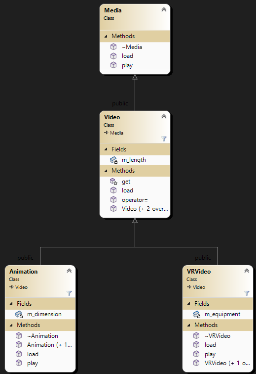

# Workshop #8: Virtual functions and Abstract base classes

Version 0.9


In this workshop, you will create a hierarchy of classes to practice and understand the role of virtual functions in inheritance. 
The workshop consists of 5 classes:  
- Media; Any media that can be loaded and played <br />
(An interface, that is an abstract base class with only pure virtual functions)
- Video; is a media that is defined with the duration of playback (length)  <br />
(An abstract base class that represents Video Media) 
-  VRVideo; is a video that needs a piece of special equipment to play <br />
(A concrete class that plays VRVideos using some type of headset)
- Animation; is a video that has a dimension attribute <br />
(A concrete class that plays 2D or 3D Animation videos.)


## Learning Outcomes

Upon successful completion of this workshop, you will have demonstrated the abilities to:

- define pure virtual functions
- create abstract base classes
- implement behaviours using virtual functions
- explain the difference between an abstract base class and a concrete class
- describe what you have learned in completing this workshop


## Submission Policy


The workshop is divided into one coding part and one non-coding part:

- Part 1 (**LAB**): A step-by-step guided workshop, worth 100% of the workshop's total mark
> Please note that the part 1 section is **not to be started in your first session of the week**. You should start it on your own before the day of your class and join the first session of the week to ask for help and correct your mistakes (if there are any).
- Part 2 (reflection): non-coding part. The reflection doesn't have marks associated with it but can incur a **penalty of max 40% of the whole workshop's mark** if your professor deems it insufficient (you make your marks from the code, but you can lose some on the reflection).

## Due Dates

The Due dates depend on your section. Please choose the "-due" option of the submitter program to see the exact due date of your section:

```bash
~profname.proflastname/submit 2??/wX/pY_sss -due<ENTER>
```
- Replace **??** with your subject code (`00 or 44`)
- Replace **X** with Workshop number: [`1 to 10`]
- Replace **Y** with the part number: [`1 or 2`]
- Replace **sss** with the section: [`naa, nbb, nra, zaa, etc...`]

## Late penalties
You are allowed to submit your work up to 2 days after the due date with a 30% penalty for each day. After that, the submission will be closed and the mark will be zero.

## Citation

Every file that you submit must contain (as a comment) at the top:<br />
**your name**, **your Seneca email**, **Seneca Student ID** and the **date** when you completed the work.

### For work that is done entirely by you (ONLY YOU)

If the file contains only your work or the work provided to you by your professor, add the following message as a comment at the top of the file:

> I have done all the coding by myself and only copied the code that my professor provided to complete my workshops and assignments.

### For work that is done partially by you.

If the file contains work that is not yours (you found it online or somebody provided it to you), **write exactly which part of the assignment is given to you as help, who gave it to you, or which source you received it from.**  By doing this you will only lose the mark for the parts you got help for, and the person helping you will be clear of any wrongdoing.

> - Add the citation to the file in which you have the borrowed code
> - In the 'reflect.txt` submission of part 2 (DIY), add exactly what is added to which file and from where (or whom).

> :warning: This [Submission Policy](#submission-policy) only applies to the workshops. All other assessments in this subject have their own submission policies.

### If you have helped someone with your code

If you have helped someone with your code. Let them know of these regulations and in your 'reflect.txt' of part 2 (DIY), write exactly which part of your code was copied and who was the recipient of this code.<br />By doing this you will be clear of any wrongdoing if the recipient of the code does not honour these regulations.

## Compiling and Testing Your Program

All your code should be compiled using this command on `matrix`:

```bash
g++ -Wall -std=c++11 -g -o ws file1.cpp file2.cpp ...
```

- `-Wall`: the compiler will report all warnings
- `-std=c++11`: the code will be compiled using the C++11 standard
- `-g`: the executable file will contain debugging symbols, allowing *valgrind* to create better reports
- `-o ws`: the compiled application will be named `ws`

After compiling and testing your code, run your program as follows to check for possible memory leaks (assuming your executable name is `ws`):

```bash
valgrind --show-error-list=yes --leak-check=full --show-leak-kinds=all --track-origins=yes ws
```

- `--show-error-list=yes`: show the list of detected errors
- `--leak-check=full`: check for all types of memory problems
- `--show-leak-kinds=all`: show all types of memory leaks identified (enabled by the previous flag)
- `--track-origins=yes`: tracks the origin of uninitialized values (`g++` must use `-g` flag for compilation, so the information displayed here is meaningful).

To check the output, use a program that can compare text files.  Search online for such a program for your platform, or use *diff* available on `matrix`.

> Note: All the code written in workshops and the project must be implemented in the **sdds** namespace, unless instructed otherwise.

### Custom code submission

If you have any additional custom code, (i.e. functions, classes etc) that you want to reuse in the workshop save them under a module called Utils (`Utils.cpp and Utils.h`) and submit them with your workshop using the instructions in the "[Submitting Utils Module](#submitting-utils-module)" section.
# lab (part 1) (100%)

Implement four modules for the following classes; **Media, Video,  VRVideo** and **Animation**




## 1- The `Media` interface

### Create the following two [Pure virtual functions](https://ict.senecacollege.ca/~oop244/pages/content/abstr.html#pur):
> a [pure virtual function](https://ict.senecacollege.ca/~oop244/pages/content/abstr.html#pur) is a virtual function that has no implementation.  To indicate that the pure virtual function does not have an implementation, set its prototype to zero (```= 0;```) in the class declaration.

#### play  
Returns reference to **ostream** and receives a reference to **ostream** as an argument.  This pure virtual function can not modify the current object.

#### load
Returns void and receives a reference to **istream** as an argument. 

### `destructor`
Create a virtual empty destructor for the Media interface. 
> this guarantees that any dynamically allocated derived class from the Media interface pointed by a base class pointer will be removed properly from memory when deleted.

### `Media` helper functions
Overload the insertion and extraction operators (using **play** and **load** functions) so any Media object can be written or read using ostream and istream.


## 2- The `Video` Abstract Class
Inherit an abstract class from the interface `Media` called `Video`.  This class represents a Video-Media with a specific duration of playback.

This class will implement the pure virtual function **load** but will not implement the play function; therefore it remains abstract.

### Private Member variable
Add an integer type member **m_length** which defines the length of the video. 


### Protected members 
#### ``` get() ```
Add a query called **get** that returns the value of the `m_length` member variable. This query can not change the status of a Video.

### public members
#### Default (no argument) constructor
Sets the m_length to 0.
#### One argument constructor
Set the m_length value to the incoming argument. If the length value is invalid (negative) the video will be set to be empty

#### deleted actions
The copy constructor and assignment operator are deleted to prevent copying or assignment of instances of this class.
#### load
Reads the length from the istream and sets the data member, assuming that the length value is comma ',' terminated. (The terminating comma should be extracted from the istream)

#### other methods
You can add any other methods if needed, to accomplish the above.

## 3- The `VRVideo` concrete class
VRVideo (Virtual Reality Video) inherits the **Video** class to create a VRVideo. This class adds an equipment name to the Video class (for example: "Oculus Rift headset")

### Private Member variable
Create a member pointer variable called **m_equipment** to hold the dynamically allocated C-string specifying the special equipment required for VRVideo.

#### Default (no argument) constructor
Sets the **m_equipment** member variable to a null pointer and defaults the Base class Video.

#### Two argument constructor
Receives the Video length and a C-string for the name of the equipment.<br />
The video length is used to initialize the Base class (Video) and a copy of the name of equipment is kept Dynamically by the m_equipment attribute.<br />
If either the length or the equipment name is invalid, then VRvideo will be set to empty.

#### Destructor
Deallocates the m_equipment dynamic C-string.

#### load
Reads comma-separated specs of the **VRVideo** from istream.<br />
This function overrides the **load** function of the base class as follows.<br />
First, it will call the **load** function of the base class and then reads the C-string until newline (\n)and ignores newline. Afterward, follow the same logic as was done in the two-argument constructor but make sure the m_equipment is deallocated before overwriting the newly allocated memory.

#### play
This function overrides the play function of the base class.<br />
If the VRVideo is not empty, this function will first print the **VRVideo requires** followed by **m_equipement** and then go to the new line.  It then prints **Video Length =** followed by **get()** of the base, Video class<br />
Otherwise, it will take no action.

For the exact output format, look at the execution sample.

## 4- The `Animation` concrete class

The Animation class inherits the **Video** class to create an Animation video in 2 or 3 dimensions.

### Private Member variable
Create an int variable **m_dimension** to hold the dimension of the Animated video.

#### Default (no argument) constructor
Sets m_dimension to 0 and defaults the base class.

#### Two argument constructor
Receives two arguments; an int type for the `m_length` and another int type for the `m_dimension` of the **Animation** from the argument list.  Passes the appropriate data to the constructor of the base class and sets the **m_dimension** member variable to the corresponding value received from the argument list.
However, the **m_dimension** should be either 2 or 3.  If validation fails set Animation to empty.


#### load
Reads comma-separated specs of the **Animation** from istream.<br />
This function overrides the **load** function of the base class as follows.<br />
First, it will call the **load** function of the base class, then it will read the value of the **m_dimention** from the istream and then ignores the rest of the characters up to and including the newline character (**'\n'**).<br />
The same validation will be applied to the data as in the constructor.

#### play
This function overrides the play function of the base class.<br />
If the Animation is not empty, this function will first print **Animation is in** followed by **m_dimension** followed by **-D** .  It then prints **Video Length =** followed by **get()**.<br />
Otherwise, it will take no action.

For the exact output format, look at the execution sample.

## `main` Module (supplied)

**Do not modify this module!**  Walk through the code and make sure you understand it.

<a href="lab/main.cpp" target="_blank">main.cpp</a>

### Sample Output

<a href="lab/correct_output.txt" target="_blank">correct_output.txt</a>

## Submission

### Files to submit
```Text
Media.h
Media.cpp
Video.h
Video.cpp
VRVideo.h
VRVideo.cpp
Animation.h
Animation.cpp
main.cpp
```

To test and demonstrate the execution of your program use the same data as shown in the output example.

Upload your source code and data file to your `matrix` account. Compile and run your code using the `g++` compiler as shown above and make sure that everything works properly.

Then, run the following command from your account
- replace `profname.proflastname` with your professor’s Seneca user-id
- replace **#** with the workshop number
- replace **??** with your subject code (2**00** or 2**44**)
```text
~profname.proflastname/submit 2??/w#/p1
```

and follow the instructions.

> **⚠️Important:** Please note that a successful submission does not guarantee full credit for this workshop. If the professor is not satisfied with your implementation, your professor may ask you to resubmit. Re-submissions will attract a penalty.


# Part 2: Reflection

Study your final solutions for each deliverable of the workshop **and the most recent milestones of the project**, reread the related parts of the course notes, and make sure that you have understood the concepts covered by this workshop.  **This should take no less than 30 minutes of your time and the result is suggested to be at least 150 words in length.**

Create a file named `reflect.txt` that contains your detailed description of the topics that you have learned in completing this workshop and **the project milestones** and mention any issues that caused you difficulty.


### Submission Process:

Upload the files listed above to your `matrix` account. Compile and run your code using the `g++` compiler as shown in [Compiling and Testing Your Program](#compiling-and-testing-your-program) and make sure that everything works properly.

Then, run the following command from your matrix account

```bash
~profname.proflastname/submit 2??/wX/pY_sss  <ENTER>
```
- Replace **??** with your subject code (`00 or 44`)
- Replace **X** with Workshop number: [`1 to 10`]
- Replace **Y** with the part number: [`1 or 2`]
- Replace **sss** with the section: [`naa, nbb, nra, zaa, etc...`]

and follow the instructions.
